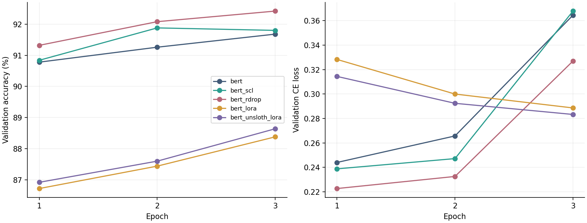
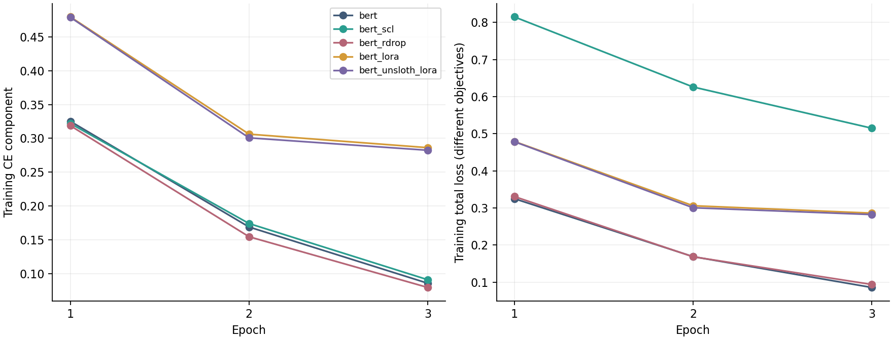

# 实验记录

## 1. 为什么选 BERT

前面的任务已经做过多种预训练模型。这次我没有再追求更大的基座，而是固定 `bert-base-uncased`，把资源用于检验附加损失和参数高效微调。这样 CE/SCL/R-Drop 的差异主要来自损失，普通 LoRA/Unsloth LoRA 则用于观察训练方式和资源开销。

没有把六种旧模型重跑一遍，也没有重跑 DeBERTa-xxlarge。这个仓库专门记录本次任务。

## 2. 控制了哪些变量

| 项目 | 设置 |
|---|---|
| 数据来源 | Kaggle 官方带标签训练数据 |
| 训练/验证 | 20,000 / 5,000，分层划分，seed 42 |
| 基座 | bert-base-uncased，同一 revision |
| 长度、epoch、学习率 | 256、3、2e-5 |
| 采样与 batch | 每个 batch 8 正/8 负，共 16，梯度累积 1 |
| 优化器 | AdamW，weight decay 0.01，线性调度，10% warmup |
| 精度 | FP32 参数，BF16 autocast |
| checkpoint 选择 | 验证 Accuracy 最佳，不是 Kaggle 分数最佳 |
| 验证目标 | 单次 forward 的 CE，Accuracy、F1、ROC-AUC |
| 硬件 | 单张 RTX 4090 D 24GB |

两套环境的真实版本保存在每个结果目录里。基线/SCL/R-Drop/普通 LoRA 使用 Torch 2.8.0+cu128、Transformers 5.12.1、PEFT 0.19.1；Unsloth 使用 Torch 2.12.1+cu130、Transformers 5.5.0、PEFT 0.21.2。因此对 Unsloth 的比较仍有环境版本这个混杂因素。

## 3. 完整微调：CE、SCL 与 R-Drop

| 方法 | 最佳验证 Accuracy | 最佳验证 F1 | 最佳验证 AUC | Kaggle AUC | 最佳 epoch |
|---|---:|---:|---:|---:|---:|
| CE | 0.9168 | 0.91762 | 0.97239 | 0.97434 | 3 |
| CE + 0.2 SCL | 0.9188 | 0.92014 | 0.97339 | 0.97566 | 2 |
| 平均 CE + 双向 KL | 0.9242 | 0.92476 | 0.97465 | 0.97637 | 3 |

相对 CE，SCL 多判对 10 条验证样本，R-Drop 多判对 37 条。Kaggle AUC 分别增加 0.00132 和 0.00203。本次三项指标都以 R-Drop 最好，但还只有一次 seed，不能说已经证明它在所有设置下都优于 SCL。

SCL 最佳 epoch 是第 2 轮，末轮 Accuracy 是 0.9180。结果表与 submission 使用第 2 轮 checkpoint，不能拿末轮指标去解释这份提交。

CE 的验证 loss 从第 1 轮约 0.244 增长到第 3 轮约 0.365，而 Accuracy 同时上升。loss 对错误预测的置信度敏感，Accuracy 只看分类是否正确，两者可以不同步。这提示我需要关注过拟合和过度自信，不能只看准确率一项。

训练图左边比较 CE 分量，右边是各方法的总损失。SCL 总损失包含额外项，数值比 CE 大本身不代表更差；R-Drop 的 CE 分量是两次 CE 的平均。验证图中的 loss 才是统一的 CE 口径。

## 4. SCL 到底改变了哪些样本

在相同的 5,000 条验证样本上，比较 CE 和最佳 SCL checkpoint：

| 类别 | 数量 |
|---|---:|
| CE 错、SCL 对 | 79 |
| CE 对、SCL 错 | 69 |
| 两者都错 | 337 |
| 两者都对 | 4,515 |

净增 10 条，与 Accuracy 增加 0.20 个百分点一致。这说明 SCL 有收益，也引入了新的错误，不能只挑改对的评论展示。具体样本 ID 保存在 [paired_errors.json](../results/paired_errors.json)，可以在本地官方数据中定位原文。公开仓库没有复制大量评论文本。

我还在相同的 1,000 条验证样本上检查了归一化 `[CLS]` 表示，排除自身配对后取余弦均值：

| 方法 | 同类均值 | 异类均值 | 两者差值 |
|---|---:|---:|---:|
| CE | 0.71463 | -0.25236 | 0.96699 |
| SCL | 0.94788 | 0.75161 | 0.19627 |
| R-Drop | 0.71103 | -0.31917 | 1.03020 |

SCL 同类相似度上升，但异类相似度也大幅上升，简单均值差反而变小。因此当前结果不能写成“类内更紧、类间更远”都实现了。这可能与表示的公共方向、单视图、alpha、temperature 或特征选择有关，仍需后续检验。余弦均值只是诊断，不等于分类性能，也不足以直接认定表示坍塌。

## 5. LoRA 与 Unsloth

| 方法 | 训练耗时 s | 前 20 次更新后连续 100 次更新耗时 s | 峰值 allocated GiB | 可训练参数 |
|---|---:|---:|---:|---:|
| 完整 CE | 266.85 | 6.596 | 3.050 | 109,483,778 |
| 完整 SCL | 279.58 | 6.902 | 3.149 | 109,483,778 |
| 完整 R-Drop | 337.07 | 8.428 | 4.788 | 109,483,778 |
| 普通 LoRA | 244.76 | 5.986 | 1.779 | 591,362 |
| Unsloth LoRA | 246.78 | 5.980 | 1.777 | 591,362 |

总训练耗时包含训练中的验证和保存，不包含依赖安装、模型下载、最终测试推理。显存是 PyTorch 的 `max_memory_allocated`，不是 `nvidia-smi` 中进程总占用；reserved 数值另外保存在 summary。

LoRA 可训练参数约为自身总参数 110,075,140 的 0.537%，峰值 allocated 显存相对完整 CE 降低约 41.7%。但相同学习率和仅三轮训练下，LoRA 的验证准确率比完整微调低。下一步应在验证集上单独调整 LoRA 的学习率、训练轮数和秩，不能把这一轮结果写成 LoRA 必然较差。

本次 Unsloth 关闭编译，未量化，基座是 BERT。普通 LoRA 与 Unsloth 的 100 步耗时几乎相同，总耗时也没有明显优势。不能根据框架的宣传推断这次已经获得两倍加速。后续需要统一依赖、重复计时，并明确启用哪些优化。

## 6. 短步组合测试

Unsloth + LoRA + SCL 在 512 条训练/128 条验证上完成 30 步，记录的训练平均 CE 约 0.73226，SCL 约 2.93698，总损失约 1.31965，符合 `CE + 0.2*SCL`。

这部分只有保留日志中的 summary，未保留完整短步权重与逐步目录。它用于说明自定义 Trainer 能接入 Unsloth，不用于比较正式准确率。当前尚缺 Unsloth + LoRA + SCL 的全量三轮结果。

## 7. 下一步

我优先考虑补全 Unsloth + LoRA + SCL 的正式对照，并为 CE/SCL/R-Drop 增加多个随机种子。之后再做 alpha、temperature、单/双视图或特征位置的消融，检查性能变化是否稳定。所有超参数由验证集选择，测试集只用于最终报告。

本次已整理的结论是：SCL 和 R-Drop 在当前配置下都有小幅提升；R-Drop 代价更高；LoRA 节省参数与显存，但还有性能差距；Unsloth 接入已完成，不夸大当前的加速结果。
